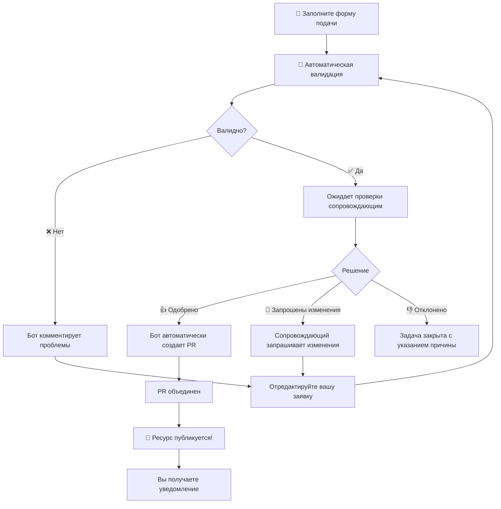

# Вклад в Awesome Claude Code

Добро пожаловать! Мы рады, что вы хотите внести свой вклад в Awesome Claude Code. Это руководство проведет вас через наш упрощенный процесс участия.

**Важно:** Мы серьезно относимся к безопасности. Все материалы тщательно проверяются, чтобы убедиться, что они не подвергают пользователей риску утечки данных или вредоносного кода. Проверка продвинутых инструментов может занять дополнительное время.

## Кодекс поведения

Обратите внимание, что этот проект выпущен с [Кодексом поведения участников](code-of-conduct.ru.md). Участвуя в этом проекте, вы соглашаетесь соблюдать его условия. Следуйте соглашениям репозитория и не занимайтесь самопродвижением. Используйте описательный язык, а не "маркетинговый" стиль.

## Как отправить ресурс

### 🚀 **[Нажмите здесь, чтобы отправить новый ресурс](https://github.com/hesreallyhim/awesome-claude-code/issues/new?template=submit-resource.yml)**

Вот и всё! Просто нажмите на ссылку выше и заполните форму. Знание Git не требуется.

### Процесс подачи

Вот что происходит, когда вы отправляете ресурс:



### Что мы проверяем

Когда вы отправляете ресурс, наш бот проверяет:

- ✅ Все обязательные поля заполнены
- ✅ URL-адреса действительны и доступны
- ✅ Нет дублирующихся ресурсов
- ✅ Информация о лицензии (при наличии)
- ✅ Длина и качество описания

### Если требуются изменения

Не беспокойтесь, если валидация не пройдена! Бот:

1. Опубликует четкий комментарий, объясняющий, что нужно исправить
2. Обновит метки задачи, чтобы отразить статус
3. Автоматически повторно проверит, когда вы отредактируете свою заявку

Просто отредактируйте свою задачу, чтобы исправить любые проблемы - нет необходимости создавать новую заявку.

### Процесс одобрения

После прохождения валидации:

1. Сопровождающий проверит вашу заявку на качество и релевантность
2. Они могут:
   - ✅ **Одобрить** - Введут `/approve`, и бот создаст PR
   - 🔄 **Запросить изменения** - Введут `/request-changes` с обратной связью
   - ❌ **Отклонить** - Введут `/reject` с указанием причины

### После одобрения

Магия происходит автоматически:

1. Бот создает новую ветку из последней версии main (без конфликтов слияния!)
2. Добавляет ваш ресурс в CSV
3. Регенерирует README
4. Создает запрос на включение изменений (PR)
5. Связывает всё с вашей задачей
6. Закрывает вашу задачу подачи

Вы будете уведомлены на каждом этапе, и если ваш ресурс находится на GitHub, вы получите специальное уведомление в своем репозитории! 🎉

## Что делает ресурс "Awesome"

Ваша заявка должна:

- ✨ Предоставлять реальную ценность пользователям Claude Code
- 🚀 Демонстрировать инновационные или образцовые шаблоны использования
- 📚 Следовать лучшим практикам для типа ресурса
- 🔄 Работать с последней версией Claude Code
- 📝 Включать четкую документацию (демо-видео - огромный плюс!)
- ❄️ Быть уникальной и отличаться от других существующих ресурсов
- ⚖️ Соблюдать Условия использования, регулирующие использование Claude Code

Мы особенно приветствуем:

- Проверенные рабочие процессы, используемые в производстве
- Творческие эксперименты, расширяющие границы возможностей Claude Code
- Инструменты, улучшающие функциональность Claude Code
- Нетрадиционные приложения (CI/CD, тестирование, документация)

## Категории

Ресурсы организованы по следующим категориям:

- **Рабочие процессы и руководства по знаниям** - Комплексные системы рабочих процессов
- **Инструментарий** - Приложения и исполняемые файлы командной строки
  - Интеграции с IDE
- **Строка состояния** - Конфигурации и настройки строки состояния
- **Хуки** - Конфигурации хуков Claude Code
- **Слэш-команды** - Отдельные файлы команд
  - Контроль версий и Git
  - Анализ кода и тестирование
  - Загрузка контекста и подготовка
  - Документация и журналы изменений
  - CI / Развертывание
  - Управление проектами и задачами
  - Разное
- **Файлы CLAUDE.md** - Файлы конфигурации проекта
  - Специфичные для языка
  - Специфичные для домена
  - Каркас проекта и MCP
- **Официальная документация** - Ресурсы Anthropic

## Другие вклады

### Предложение улучшений

Для предложений о структуре репозитория, новых категориях или других улучшениях:

1. **[Откройте общую задачу](https://github.com/hesreallyhim/awesome-claude-code/issues/new)**
2. Четко опишите ваше предложение
3. Объясните пользу для сообщества

### Сообщение о проблемах

Если вы обнаружили проблемы с существующими ресурсами или процессом подачи:

- 📖 Проверьте существующие задачи на наличие похожих сообщений
- 💬 Откройте новую задачу с подробностями
- 🐛 Включите сообщения об ошибках и шаги для воспроизведения
- 🔒 Немедленно сообщайте о проблемах безопасности

## Значки

Если ваша заявка одобрена, вы можете добавить значок в свой README:

[](https://github.com/hesreallyhim/awesome-claude-code)

```markdown
[](https://github.com/hesreallyhim/awesome-claude-code)
```

Или плоская версия:

[](https://github.com/hesreallyhim/awesome-claude-code)

```markdown
[](https://github.com/hesreallyhim/awesome-claude-code)
```

## Уведомления репозитория GitHub

Если ваш ресурс находится на GitHub, наша автоматизированная система создаст дружественное уведомление в вашем репозитории, информирующее вас о включении и предоставляющее варианты значков.

## Технические детали

Для получения дополнительной информации о работе репозитория, включая автоматизированные системы, процессы валидации и техническую архитектуру, см. [HOW_IT_WORKS.ru.md](HOW_IT_WORKS.ru.md).

---

Спасибо, что помогаете сделать Awesome Claude Code еще более потрясающим! 🚀
