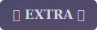
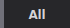
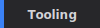
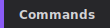
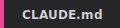
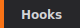
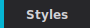
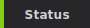
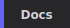

<!-- GENERATED FILE: do not edit directly -->
<!--lint disable remark-lint:awesome-badge-->

<h3 align="center">Pick Your Style:</h3>

# Awesome Claude Code (Flat)

A flat list view of all resources. Category: **CLAUDE.md** | Sorted: by latest release (30 days)

---

## Sort By:

  
  
  
  

<strong>Category:</strong>

  
  
  
  
  
  
  
  
  
  
  

<em>Currently viewing: **CLAUDE.md** sorted by latest release (30 days) (past 30 days)</em>

---

## Resources

> **Note:** Latest release data is pulled from GitHub Releases only. Projects without GitHub Releases will not show release info here. Please verify with the project directly.

<table>
<thead>
<tr>
<th>Resource</th>
<th>Version</th>
<th>Source</th>
<th>Release Date</th>
<th>Description</th>
</tr>
</thead>
<tbody>
<tr>
<td><a href="https://github.com/sgcarstrends/backend/blob/main/CLAUDE.md"><b>SG Cars Trends Backend</b></a> by <a href="https://github.com/sgcarstrends">sgcarstrends</a></td>
<td>v4.47.2</td>
<td>GitHub</td>
<td>2026-02-13</td>
<td>Provides comprehensive structure for TypeScript monorepo projects with detailed commands for development, testing, deployment, and AWS/Cloudflare integration.</td>
</tr>
<tr>
<td colspan="5">        </td>
</tr>
<tr>
<td><a href="https://github.com/giselles-ai/giselle/blob/main/CLAUDE.md"><b>Giselle</b></a> by <a href="https://github.com/giselles-ai">giselles-ai</a></td>
<td>v0.63.1</td>
<td>GitHub</td>
<td>2026-02-13</td>
<td>Provides detailed build and test commands using pnpm and Vitest with strict code formatting requirements and comprehensive naming conventions for code consistency.</td>
</tr>
<tr>
<td colspan="5">        </td>
</tr>
<tr>
<td><a href="https://github.com/basicmachines-co/basic-memory/blob/main/CLAUDE.md"><b>Basic Memory</b></a> by <a href="https://github.com/basicmachines-co">basicmachines-co</a></td>
<td>v0.18.4</td>
<td>GitHub</td>
<td>2026-02-12</td>
<td>Presents an innovative AI-human collaboration framework with Model Context Protocol for bidirectional LLM-markdown communication and flexible knowledge structure for complex projects.</td>
</tr>
<tr>
<td colspan="5">        </td>
</tr>
<tr>
<td><a href="https://github.com/langchain-ai/langgraphjs/blob/main/CLAUDE.md"><b>LangGraphJS</b></a> by <a href="https://github.com/langchain-ai">langchain-ai</a></td>
<td>@langchain/langgraph-api@1.1.13</td>
<td>GitHub</td>
<td>2026-02-11</td>
<td>Offers comprehensive build and test commands with detailed TypeScript style guidelines, layered library architecture, and monorepo structure using yarn workspaces.</td>
</tr>
<tr>
<td colspan="5">        </td>
</tr>
<tr>
<td><a href="https://github.com/hashintel/hash/blob/main/CLAUDE.md"><b>HASH</b></a> by <a href="https://github.com/hashintel">hashintel</a></td>
<td>@hashintel/petrinaut@0.0.8</td>
<td>GitHub</td>
<td>2026-01-28</td>
<td>Features comprehensive repository structure breakdown with strong emphasis on coding standards, detailed Rust documentation guidelines, and systematic PR review process.</td>
</tr>
<tr>
<td colspan="5">        </td>
</tr>
<tr>
<td><a href="https://github.com/CommE2E/comm/blob/master/CLAUDE.md"><b>Comm</b></a> by <a href="https://github.com/CommE2E">CommE2E</a></td>
<td>mobile-v1.0.562</td>
<td>GitHub</td>
<td>2026-01-22</td>
<td>Serves as a development reference for E2E-encrypted messaging applications with code organization architecture, security implementation details, and testing procedures.</td>
</tr>
<tr>
<td colspan="5">        </td>
</tr>
</tbody>
</table>

---

**Total Resources:** 6

**Last Generated:** 2026-02-15
