<!-- 生成文件：请勿直接编辑 -->
<h3 align="center">选择您的风格：</h3>

  <picture>
    
  </picture>

# Awesome Claude Code 中文版

> 一个精心策划的斜杠命令、CLAUDE.md 文件、CLI 工具和其他资源的精选列表，用于增强您的 [Claude Code](https://docs.anthropic.com/en/docs/claude-code) 工作流程。

Claude Code 是 [Anthropic](https://www.anthropic.com/) 提供的基于 CLI 的编码助手，您可以在终端或 IDE 中访问。此列表帮助社区分享知识和最佳实践。

## 最新添加

- [Ralph Wiggum 插件](https://github.com/anthropics/claude-code/tree/4f18698a9ed25517861a75125b526e319bcf8354/plugins/ralph-wiggum) by [Anthropic PBC](https://github.com/anthropics) - Anthropic 官方实现的 Ralph Wiggum 技术，用于 Claude Code 中的迭代、自引用 AI 开发循环。
- [ralph-orchestrator](https://github.com/mikeyobrien/ralph-orchestrator) by [mikeyobrien](https://github.com/mikeyobrien) - Ralph Orchestrator 实现了简单但有效的 "Ralph Wiggum" 技术，用于自主完成任务，持续运行 AI 代理处理提示文件，直到任务标记为完成或达到限制。此实现提供了一个健壮、经过充分测试且功能完整的 AI 驱动开发编排系统。也在 Anthropic Ralph 插件文档中被引用。
- [Ralph for Claude Code](https://github.com/frankbria/ralph-claude-code) by [Frank Bria](https://github.com/frankbria) - 一个自主的 AI 开发框架，使 Claude Code 能够迭代地处理项目直到完成。具有智能退出检测、速率限制、断路器模式和全面的安全防护措施，以防止无限循环和 API 过度使用。使用 Bash 构建，与 tmux 集成进行实时监控，并包含 75+ 个全面的测试。

## 目录

- [代理技能 🤖](#代理技能-)
  - [通用](#通用)
- [工作流程与知识指南 🧠](#工作流程与知识指南-)
  - [通用](#通用-1)
- [工具 🧰](#工具-)
  - [通用](#通用-2)
  - [IDE 集成](#ide-集成)
  - [使用监控](#使用监控)
  - [编排器](#编排器)
- [状态栏 📊](#状态栏-)
  - [通用](#通用-3)
- [钩子 🪝](#钩子-)
  - [通用](#通用-4)
- [斜杠命令 🔪](#斜杠命令-)
  - [通用](#通用-5)
  - [版本控制与 Git](#版本控制与-git)
  - [代码分析与测试](#代码分析与测试)
  - [上下文加载与初始化](#上下文加载与初始化)
  - [文档与变更日志](#文档与变更日志)
  - [CI / 部署](#ci--部署)
  - [项目与任务管理](#项目与任务管理)
  - [其他](#其他)
- [CLAUDE.md 文件 📂](#claudemd-文件-)
  - [语言特定](#语言特定)
  - [领域特定](#领域特定)
  - [项目脚手架与 MCP](#项目脚手架与-mcp)
- [替代客户端 📱](#替代客户端-)
  - [通用](#通用-6)
- [官方文档 🏛️](#官方文档-️)
  - [通用](#通用-7)

## 代理技能 🤖

> 代理技能是模型控制的配置（文件、脚本、资源等），使 Claude Code 能够执行需要特定知识或能力的专业任务。

### 通用

- [Claude Codex Settings](https://github.com/fcakyon/claude-codex-settings) by [fatih akyon](https://github.com/fcakyon) - 一套组织良好、编写精良的插件集，涵盖核心开发活动，例如与常见云平台（如 GitHub、Azure、MongoDB）以及流行服务（如 Tavily、Playwright 等）的协作。清晰、不过于主观，并与一些其他提供商兼容。
- [Claude Mountaineering Skills](https://github.com/dreamiurg/claude-mountaineering-skills) by [Dmytro Gaivoronsky](https://github.com/dreamiurg) - Claude Code 技能，自动化北美山峰的山地路线研究。聚合来自 10+ 个登山来源（如 Mountaineers.org、PeakBagger.com 和 SummitPost.com）的数据，生成包含天气、雪崩状况和行程报告的详细路线报告。
- [Codex Skill](https://github.com/skills-directory/skill-codex) by [klaudworks](https://github.com/klaudworks) - 使用户能够从 Claude Code 提示 Codex。与原始的 Codex MCP 服务器不同，此技能从您的提示中推断参数（如模型、推理努力、沙箱化）或要求您指定它们。还简化了继续先前的 Codex 会话，使 Codex 能够继续使用先前的上下文。
- [Context Engineering Kit](https://github.com/NeoLabHQ/context-engineering-kit) by [Vlad Goncharov](https://github.com/LeoVS09) - 精心制作的高级上下文工程技术与模式集合，专注于以最小的 token 占用提高代理结果质量。
- [Ralph for Claude Code](https://github.com/frankbria/ralph-claude-code) by [Frank Bria](https://github.com/frankbria) - 一个自主的 AI 开发框架，使 Claude Code 能够迭代地处理项目直到完成。具有智能退出检测、速率限制、断路器模式和全面的安全防护措施，以防止无限循环和 API 过度使用。使用 Bash 构建，与 tmux 集成进行实时监控，并包含 75+ 个全面的测试。
- [Superpowers](https://github.com/obra/superpowers) by [Jesse Vincent](https://github.com/obra) - 一套强大的软件工程核心能力集合，良好覆盖了大部分软件开发生命周期 - 从规划、审查、测试、调试... 编写精良，组织良好，且具有适应性。作者称它们为 "超能力"，但其中许多只是整合了工程最佳实践 - 在与 Claude Code 合作时，有时确实感觉像超能力。
- [TÂCHES Claude Code Resources](https://github.com/glittercowboy/taches-cc-resources) by [TÂCHES](https://github.com/glittercowboy) - 一套平衡、"脚踏实地" 的子代理、技能和命令集合，组织良好，易于阅读，并健康地关注 "元" 技能/代理，如 "skill-auditor"、钩子创建等 - 您可以适应自己的工作流程，而不是反过来。
- [Web Assets Generator Skill](https://github.com/alonw0/web-asset-generator) by [Alon Wolenitz](https://github.com/alonw0) - 轻松从 Claude Code 生成 Web 资源，包括网站图标、应用图标（PWA）和社交媒体元图像（Open Graph），用于 Facebook、Twitter、WhatsApp 和 LinkedIn。处理图像调整大小、文本到图像生成、表情符号，并提供适当的 HTML 元标签。

 

## 工作流程与知识指南 🧠

> 工作流程是一组紧密耦合的 Claude Code 原生资源，用于促进特定项目

### 通用

- [AB Method](https://github.com/ayoubben18/ab-method) by [Ayoub Bensalah](https://github.com/ayoubben18) - 一个原则性、规范驱动的工作流程，将大问题转化为专注的、增量任务，使用 Claude Code 的专用子代理。包括斜杠命令、子代理和专为 SDLC 特定部分设计的专门工作流程。
- [Agentic Workflow Patterns](https://github.com/ThibautMelen/agentic-workflow-patterns) by [ThibautMelen](https://github.com/ThibautMelen) - 一个全面且文档完善的代理模式集合，来自 Anthropic 文档，每个模式都有彩色 Mermaid 图和代码示例。涵盖子代理编排、渐进技能、并行工具调用、主-克隆架构、向导工作流程等。也与其他提供商兼容。
- [Blogging Platform Instructions](https://github.com/cloudartisan/cloudartisan.github.io/tree/main/.claude/commands) by [cloudartisan](https://github.com/cloudartisan) - 提供一套结构良好的命令，用于发布和维护博客平台，包括创建帖子、管理类别和处理媒体文件的命令。
- [Claude Code Documentation Mirror](https://github.com/ericbuess/claude-code-docs) by [Eric Buess](https://github.com/ericbuess) - Anthropic &copy; PBC 的 Claude Code 文档页面的镜像，每隔几小时更新一次。当试图跟上 Dr. Claw D. Code, Ph.D. 不断扩展的功能集时，可能会派上用场。
- [Claude Code Handbook](https://nikiforovall.blog/claude-code-rules/) by [nikiforovall](https://github.com/nikiforovall) - Claude Code 开发工作流程的最佳实践、技巧和技术集合，通过可分发插件增强。
- [Claude Code Infrastructure Showcase](https://github.com/diet103/claude-code-infrastructure-showcase) by [diet103](https://github.com/diet103) - 一种非常创新的处理技能的方法，其核心是一种利用钩子的技术，确保 Claude 智能地选择和激活给定当前上下文的适当技能。文档完善，可适应不同的项目和工作流程。
- [Claude Code PM](https://github.com/automazeio/ccpm) by [Ran Aroussi](https://github.com/ranaroussi) - 真正全面且功能丰富的 Claude Code 项目管理工作流程。众多专用代理、斜杠命令和强大的文档。
- [Claude Code Repos Index](https://github.com/danielrosehill/Claude-Code-Repos-Index) by [Daniel Rosehill](https://github.com/danielrosehill) - 这要么是一位多产天才的作品，要么是一个非常聪明的机器人（或两者兼有），但质量如此之高，几乎无关紧要 - 作者发布的 75+ 个 Claude Code 仓库索引 - 我不是在谈论垃圾。CMS、系统设计、深度研究、物联网、代理工作流程、服务器管理、个人健康... 如果您发现谎言，请告诉我，否则请查看这些内容。
- [Claude Code System Prompts](https://github.com/Piebald-AI/claude-code-system-prompts) by [Piebald AI](https://github.com/Piebald-AI) - Claude Code 系统提示的所有部分，包括内置工具描述、子代理提示（Plan/Explore/Task）、实用提示（CLAUDE.md、compact、Bash cmd、安全审查、代理创建等）。为每个 Claude Code 版本更新。
- [Claude Code Tips](https://github.com/ykdojo/claude-code-tips) by [ykdojo](https://github.com/ykdojo) - 35+ 个简短但信息密集的 Claude Code 技巧，涵盖语音输入、系统提示修补、用于风险任务的容器工作流程、对话克隆(!)、与 Gemini CLI 的多模型编排等。不错的演示、工作脚本、一个插件，我认为这可能对每个人都有一些东西。
- [Claude CodePro](https://github.com/maxritter/claude-codepro) by [Max Ritter](https://www.maxritter.net) - Claude Code 的专业开发环境，具有规范驱动的工作流程、TDD 强制执行、跨会话记忆、语义搜索、质量钩子和模块化规则集成。有点 "重量级"，但功能丰富，覆盖范围广。
- [claude-code-docs](https://github.com/costiash/claude-code-docs) by [Constantin Shafranski](https://github.com/costiash) - Claude/Code 的 Anthropic&copy; PBC 文档站点的镜像，但具有额外功能，如全文搜索和查询时更新 - 是 `claude-code-docs` 的一个很好的伴侣，用于获取最新、完全索引的信息，以便 Claude Code 可以阅读关于自身的内容。
- [ClaudoPro Directory](https://github.com/JSONbored/claudepro-directory) by [ghost](https://github.com/JSONbored) - 精心制作、选择广泛的 Claude Code 钩子、斜杠命令、子代理文件等，涵盖一系列专业任务和工作流程。比您平均的 "一切皆 Claude 模板" 网站更好的资源。
- [Context Priming](https://github.com/disler/just-prompt/tree/main/.claude/commands) by [disler](https://github.com/disler) - 通过专门针对不同项目场景和开发上下文的命令，提供系统化的方法，为 Claude Code 提供全面的项目上下文。
- [Design Review Workflow](https://github.com/OneRedOak/claude-code-workflows/tree/main/design-review) by [Patrick Ellis](https://github.com/OneRedOak) - 一个定制的工作流程，用于实现自动化的 UI/UX 设计审查，包括专用子代理、斜杠命令、`CLAUDE.md` 摘录等。涵盖从响应式设计到可访问性的广泛标准。
- [Laravel TALL Stack AI Development Starter Kit](https://github.com/tott/laravel-tall-claude-ai-configs) by [tott](https://github.com/tott) - 使用全面的 Claude Code 配置转变您的 Laravel TALL（Tailwind、AlpineJS、Laravel、Livewire）堆栈开发，提供智能协助、系统化工作流程和领域专家咨询。
- [learn-faster-kit](https://github.com/cheukyin175/learn-faster-kit) by [Hugo Lau](https://github.com/cheukyin175) - 一个创新的 Claude Code 教育框架，灵感来自 "FASTER" 自学方法。附带各种代理、斜杠命令和工具，使 Claude Code 能够帮助您按照自己的节奏进步，采用主动学习和间隔重复等成熟的教学技术。
- [n8n_agent](https://github.com/kingler/n8n_agent/tree/main/.claude/commands) by [kingler](https://github.com/kingler) - 令人惊叹的全面代码分析、QA、设计、文档、项目结构、项目管理、优化等注释集合。
- [Project Bootstrapping and Task Management](https://github.com/steadycursor/steadystart/tree/main/.claude/commands) by [steadycursor](https://github.com/steadycursor) - 提供一套结构化命令，用于引导和管理新项目，包括用于创建和编辑自定义斜杠命令的元命令。
- [Project Management, Implementation, Planning, and Release](https://github.com/scopecraft/command/tree/main/.claude/commands) by [scopecraft](https://github.com/scopecraft) - 真正全面的 SDLC 所有方面命令集。
- [Project Workflow System](https://github.com/harperreed/dotfiles/tree/master/.claude/commands) by [harperreed](https://github.com/harperreed) - 一套命令，提供全面的工作流程系统，用于管理项目，包括任务管理、代码审查和部署流程。
- [RIPER Workflow](https://github.com/tony/claude-code-riper-5) by [Tony Narlock](https://tony.sh) - 结构化开发工作流程，强制分离研究、创新、计划、执行和审查阶段。具有用于上下文效率的整合子代理、分支感知记忆库和用于引导开发的严格模式强制执行。
- [Shipping Real Code w/ Claude](https://diwank.space/field-notes-from-shipping-real-code-with-claude) by [Diwank](https://github.com/creatorrr) - 一篇详细的博客文章，解释了作者使用 Claude Code 发布产品的过程，包括 CLAUDE.md 文件和其他有趣的资源。
- [Simone](https://github.com/Helmi/claude-simone) by [Helmi](https://github.com/Helmi) - 一个更广泛的 Claude Code 项目管理工作流程，不仅包括一套命令，还包括一个文档、指南和流程系统，以促进项目规划和执行。

 

## 工具 🧰

> 工具表示构建在 Claude Code 之上的应用程序，由比斜杠命令和 `CLAUDE.md` 文件更多的组件组成

### 通用

- [cc-sessions](https://github.com/GWUDCAP/cc-sessions) by [toastdev](https://github.com/satoastshi) - 一种有见解的、高效使用 Claude Code 进行开发的方法。
- [cc-tools](https://github.com/Veraticus/cc-tools) by [Josh Symonds](https://github.com/Veraticus) - Claude Code 钩子和实用程序的高性能 Go 实现。提供智能代码检查、测试和状态栏生成，开销最小。
- [ccexp](https://github.com/nyatinte/ccexp) by [nyatinte](https://github.com/nyatinte) - 交互式 CLI 工具，用于发现和管理 Claude Code 配置文件和斜杠命令，具有美观的终端 UI。
- [cchistory](https://github.com/eckardt/cchistory) by [eckardt](https://github.com/eckardt) - 类似于 shell 历史命令，但用于您的 Claude Code 会话。轻松列出 Claude Code 在会话中运行的所有 Bash 或 "Bash 模式"（`!`）命令以供参考。
- [cclogviewer](https://github.com/Brads3290/cclogviewer) by [Brad S.](https://github.com/Brads3290) - 一个谦逊但方便的实用程序，用于在漂亮的 HTML UI 中查看 Claude Code `.jsonl` 对话文件。
- [Claude Code Templates](https://github.com/davila7/claude-code-templates) by [Daniel Avila](https://github.com/davila7) - 令人难以置信的令人惊叹的资源集合，来自此列表中的每个类别，呈现整洁、精美的 UI，具有使用仪表板、分析等出色功能，从斜杠命令到钩子到代理的一切。此精选列表的一个绝佳伴侣。
- [Claude Composer](https://github.com/possibilities/claude-composer) by [Mike Bannister](https://github.com/possibilities) - 一个为 Claude Code 添加小增强的工具。
- [Claude Hub](https://github.com/claude-did-this/claude-hub) by [Claude Did This](https://github.com/claude-did-this) - 一个将 Claude Code 连接到 GitHub 仓库的 Webhook 服务，通过拉取请求和问题直接启用 AI 驱动的代码协助。此集成允许 Claude 分析仓库、回答技术问题，并通过简单的 @mentions 帮助开发人员理解和改进他们的代码库。
- [claude-code-tools](https://github.com/pchalasani/claude-code-tools) by [Prasad Chalasani](https://github.com/pchalasani) - 精心制作的会话连续性工具集，具有技能/命令，可避免压缩并在会话之间恢复上下文，实现 Claude Code 和 Codex CLI 之间的跨代理交接。包括基于 Rust/Tantivy 的快速全文会话搜索（人类用 TUI，代理用技能/CLI）、用于与脚本和 CLI 代理交互的 tmux-cli 技能 + 命令，以及阻止危险命令的安全钩子。
- [claude-starter-kit](https://github.com/serpro69/claude-starter-kit) by [serpro69](https://github.com/serpro69) - 这是一个启动模板仓库，旨在为 Claude-Code 提供完整的开发环境，预配置 MCP 服务器和工具，用于 AI 驱动的开发工作流程。该仓库有意保持最小化，仅包含三个主要系统的配置模板：Claude Code、Serena 和 Task Master。
- [claudekit](https://github.com/carlrannaberg/claudekit) by [Carl Rannaberg](https://github.com/carlrannaberg) - 令人印象深刻的 CLI 工具包，提供自动保存检查点、代码质量钩子、规范生成和执行，以及 20+ 个专用子代理，包括 oracle（gpt-5）、code-reviewer（6 方面深度分析）、ai-sdk-expert（Vercel AI SDK）、typescript-expert 等，用于 Claude Code 工作流程。
- [Container Use](https://github.com/dagger/container-use) by [dagger](https://github.com/dagger) - 编码代理的开发环境。使多个代理能够安全、独立地与您首选的堆栈一起工作。
- [ContextKit](https://github.com/FlineDev/ContextKit) by [Cihat Gündüz](https://github.com/Jeehut) - 一个系统化的开发框架，将 Claude Code 转变为主动的开发伙伴。具有 4 阶段规划方法、专用质量代理和结构化工作流程，帮助 AI 在第一次尝试时生成生产就绪的代码。
- [recall](https://github.com/zippoxer/recall) by [zippoxer](https://github.com/zippoxer) - 全文搜索您的 Claude Code 会话。在终端中运行 `recall`，输入搜索，按 Enter 恢复。`claude --resume` 的替代方案。
- [Rulesync](https://github.com/dyoshikawa/rulesync) by [dyoshikawa](https://github.com/dyoshikawa) - 一个 Node.js CLI 工具，自动为各种 AI 编码代理生成配置（规则、忽略文件、MCP 服务器、命令和子代理）。Rulesync 可以在 Claude Code 和其他 AI 代理之间双向转换配置。
- [run-claude-docker](https://github.com/icanhasjonas/run-claude-docker) by [Jonas](https://github.com/icanhasjonas/) - 一个自包含的 Docker 运行器，将您当前的工作空间转发到安全（更安全）的隔离 Docker 容器中，您仍然可以访问您的 Claude Code 设置、身份验证、ssh 代理、pgp，可选地还有 aws 密钥等。
- [stt-mcp-server-linux](https://github.com/marcindulak/stt-mcp-server-linux) by [marcindulak](https://github.com/marcindulak) - 使用 Python MCP 服务器为 Linux 设置的按下说话语音转录。在 Docker 中本地运行，无需外部 API 调用。您的语音被录制、转录为文本，然后发送到在 Tmux 会话中运行的 Claude。
- [SuperClaude](https://github.com/SuperClaude-Org/SuperClaude_Framework) by [SuperClaude-Org](https://github.com/SuperClaude-Org) - 一个多功能配置框架，通过专用命令、认知角色和开发方法（如 "内省" 和 "编排"）增强 Claude Code。
- [tweakcc](https://github.com/Piebald-AI/tweakcc) by [Piebald-AI](https://github.com/Piebald-AI) - 用于自定义 Claude Code 样式的命令行工具。
- [Vibe-Log](https://github.com/vibe-log/vibe-log-cli) by [Vibe-Log](https://github.com/vibe-log) - 本地分析您的 Claude Code 提示（使用 CC），提供智能会话分析和可操作的战略指导 - 在状态栏中工作，并生成非常漂亮的 HTML 报告。易于安装和移除。
- [viwo-cli](https://github.com/OverseedAI/viwo) by [Hal Shin](https://github.com/hal-shin) - 在 Docker 容器中运行 Claude Code，使用 git worktrees 作为卷挂载，以实现更安全地使用 `--dangerously-skip-permissions` 进行无摩擦的一次性提示。允许用户轻松在后台启动多个 Claude Code 实例，减少权限疲劳。
- [VoiceMode MCP](https://github.com/mbailey/voicemode) by [Mike Bailey](https://github.com/mbailey) - VoiceMode MCP 为 Claude Code 带来自然对话。它支持任何 OpenAI API 兼容的语音服务，并安装免费和开源的语音服务（Whisper.cpp 和 Kokoro-FastAPI）。

### IDE 集成

- [Claude Code Chat](https://marketplace.visualstudio.com/items?itemName=AndrePimenta.claude-code-chat) by [andrepimenta](https://github.com/andrepimenta) - 一个优雅且用户友好的 Claude Code 聊天界面，用于 VS Code。
- [claude-code-ide.el](https://github.com/manzaltu/claude-code-ide.el) by [manzaltu](https://github.com/manzaltu) - claude-code-ide.el 将 Claude Code 与 Emacs 集成，类似于 Anthropic 的 VS Code/IntelliJ 扩展。它显示基于 ediff 的代码建议，拉取 LSP/flymake/flycheck 诊断，并跟踪缓冲区上下文。它添加了可扩展的 MCP 工具支持，用于符号引用/定义、项目元数据和树-sitter AST 查询。
- [claude-code.el](https://github.com/stevemolitor/claude-code.el) by [stevemolitor](https://github.com/stevemolitor) - Claude Code CLI 的 Emacs 界面。
- [claude-code.nvim](https://github.com/greggh/claude-code.nvim) by [greggh](https://github.com/greggh) - Claude Code AI 助手与 Neovim 之间的无缝集成。
- [Claudix - Claude Code for VSCode](https://github.com/Haleclipse/Claudix) by [Haleclipse](https://github.com/Haleclipse) - 一个 VSCode 扩展，将 Claude Code 直接带入您的编辑器，具有交互式聊天界面、会话管理、智能文件操作、终端执行和实时流式响应。使用 Vue 3、TypeScript 构建。
- [crystal](https://github.com/stravu/crystal) by [stravu](https://github.com/stravu) - 一个完整的桌面应用程序，用于编排、监控和与 Claude Code 代理交互。

### 使用监控

- [CC Usage](https://github.com/ryoppippi/ccusage) by [ryoppippi](https://github.com/ryoppippi) - 方便的命令行工具，用于管理和分析 Claude Code 使用情况，基于分析本地 Claude Code 日志。呈现有关成本信息、token 消耗等的漂亮仪表板。
- [ccflare](https://github.com/snipeship/ccflare) by [snipeship](https://github.com/snipeship) - Claude Code 使用仪表板，具有 Web-UI，会让 Tableau 相形见绌。全面彻底的指标、无摩擦设置、详细日志记录、非常非常漂亮的 UI。
- [ccflare -> **better-ccflare**](https://github.com/tombii/better-ccflare/) by [tombii](https://github.com/tombii) - 光荣的 `ccflare` 使用仪表板的一个维护良好且功能增强的分支（在撰写本文时已经几个月没有更新）。`better-ccflare` 在此基础上构建，具有一些性能增强、扩展的提供商支持、错误修复、Docker 部署等。
- [Claude Code Usage Monitor](https://github.com/Maciek-roboblog/Claude-Code-Usage-Monitor) by [Maciek-roboblog](https://github.com/Maciek-roboblog) - 一个基于终端的实时工具，用于监控 Claude Code token 使用情况。它显示实时 token 消耗、燃烧率和 token 耗尽预测。功能包括视觉进度条、会话感知分析和多个订阅计划支持。
- [Claudex](https://github.com/kunwar-shah/claudex) by [Kunwar Shah](https://github.com/kunwar-shah) - Claudex - 一个基于 Web 的浏览器，用于跨项目探索您的 Claude Code 对话历史。为您的代码库建立索引以进行全文搜索。漂亮、易于导航的 UI。用于高级分析的简单仪表板界面，以及多种导出选项。（并且完全本地化，无遥测！）。
- [viberank](https://github.com/sculptdotfun/viberank) by [nikshepsvn](https://github.com/nikshepsvn) - 一个社区驱动的排行榜工具，使开发人员能够基于他们的 Claude Code 使用统计数据进行可视化、跟踪和竞争。它具有强大的数据分析、GitHub OAuth、数据验证和用户友好的 CLI/Web 提交方法。

### 编排器

- [Claude Code Flow](https://github.com/ruvnet/claude-code-flow) by [ruvnet](https://github.com/ruvnet) - 此模式充当代码优先的编排层，使 Claude 能够在递归代理周期中自主编写、编辑、测试和优化代码。
- [Claude Squad](https://github.com/smtg-ai/claude-squad) by [smtg-ai](https://github.com/smtg-ai) - Claude Squad 是一个终端应用程序，管理多个 Claude Code、Codex（和其他本地代理，包括 Aider）在单独的工作空间中，允许您同时处理多个任务。
- [Claude Swarm](https://github.com/parruda/claude-swarm) by [parruda](https://github.com/parruda) - 启动连接到一群 Claude Code 代理的 Claude Code 会话。
- [Claude Task Master](https://github.com/eyaltoledano/claude-task-master) by [eyaltoledano](https://github.com/eyaltoledano) - 一个用于 AI 驱动开发的任务管理系统，设计用于与 Cursor AI 无缝协作。
- [Claude Task Runner](https://github.com/grahama1970/claude-task-runner) by [grahama1970](https://github.com/grahama1970) - 一个专用工具，用于管理上下文隔离和专注的任务执行与 Claude Code，解决与 Claude 在复杂、多步骤项目上合作时的关键挑战：上下文长度限制和任务焦点。
- [Happy Coder](https://github.com/slopus/happy) by [GrocerPublishAgent](https://peoplesgrocers.com/en/projects) - 从您的手机或桌面并行生成和控制多个 Claude Code。Happy Coder 在您的硬件上运行 Claude Code，当 Claude 需要更多输入或权限时发送推送通知，并且不花费任何费用。
- [ralph-orchestrator](https://github.com/mikeyobrien/ralph-orchestrator) by [mikeyobrien](https://github.com/mikeyobrien) - Ralph Orchestrator 实现了简单但有效的 "Ralph Wiggum" 技术，用于自主完成任务，持续运行 AI 代理处理提示文件，直到任务标记为完成或达到限制。此实现提供了一个健壮、经过充分测试且功能完整的 AI 驱动开发编排系统。也在 Anthropic Ralph 插件文档中被引用。
- [The Agentic Startup](https://github.com/rsmdt/the-startup) by [Rudolf Schmidt](https://github.com/rsmdt) - 又一个 Claude 编排器 - 用于发布生产代码的代理、命令等的集合 - 但我喜欢这个，因为它全面、编写精良，并且是少数实际使用输出样式的资源之一！+10 分！
- [TSK - AI Agent Task Manager and Sandbox](https://github.com/dtormoen/tsk) by [dtormoen](https://github.com/dtormoen) - 一个 Rust CLI 工具，允许您将开发任务委托给在沙盒 Docker 环境中运行的 AI 代理。多个代理并行工作，返回供人工审查的 git 分支。

 

## 状态栏 📊

> 状态栏 - Claude Code 状态栏功能的配置和自定义

### 通用

- [CCometixLine - Claude Code Statusline](https://github.com/Haleclipse/CCometixLine) by [Haleclipse](https://github.com/Haleclipse) - 一个高性能的 Claude Code 状态栏工具，使用 Rust 编写，具有 Git 集成、使用跟踪、交互式 TUI 配置和 Claude Code 增强实用程序。
- [ccstatusline](https://github.com/sirmalloc/ccstatusline) by [sirmalloc](https://github.com/sirmalloc) - 一个高度可定制的状态栏格式化程序，用于 Claude Code CLI，在您的终端中显示模型信息、git 分支、token 使用情况和其他指标。
- [claude-code-statusline](https://github.com/rz1989s/claude-code-statusline) by [rz1989s](https://github.com/rz1989s) - 增强的 4 行状态栏，用于 Claude Code，具有主题、成本跟踪和 MCP 服务器监控。
- [claude-powerline](https://github.com/Owloops/claude-powerline) by [Owloops](https://github.com/Owloops) - 一个 vim 风格的 powerline 状态栏，用于 Claude Code，具有实时使用跟踪、git 集成、自定义主题等。
- [claudia-statusline](https://github.com/hagan/claudia-statusline) by [Hagan Franks](https://github.com/hagan) - 高性能的 Rust 基础状态栏，用于 Claude Code，具有持久统计跟踪、进度条和可选的云同步。功能包括 SQLite 优先持久性、git 集成、上下文进度条、燃烧率计算、XDG 兼容，支持主题（深色/浅色，NO_COLOR）。

 

## 钩子 🪝

> 钩子是 Claude Code 的强大 API，允许用户在 Claude 代理生命周期的不同点激活命令和运行脚本。

### 通用

- [Britfix](https://github.com/Talieisin/britfix) by [Talieisin](https://github.com/Talieisin) - Claude 默认输出美式拼写，这可能对以下方面产生影响：专业可信度、合规性、文档等。Britfix 转换为英式英语，具有 Claude Code 钩子，可在文件写入时自动转换。上下文感知：通过仅转换注释和文档字符串，从不转换标识符或字符串字面量，智能处理代码文件。
- [CC Notify](https://github.com/dazuiba/CCNotify) by [dazuiba](https://github.com/dazuiba) - CCNotify 为 Claude Code 提供桌面通知，提醒您输入需求或任务完成，具有一键跳回 VS Code 和任务持续时间显示。
- [cchooks](https://github.com/GowayLee/cchooks) by [GowayLee](https://github.com/GowayLee) - 一个轻量级的 Python SDK，具有干净的 API 和良好的文档；简化编写钩子并将其集成到代码库的过程，提供对 JSON 配置文件的良好抽象。
- [Claude Code Hook Comms (HCOM)](https://github.com/aannoo/claude-hook-comms) by [aannoo](https://github.com/aannoo) - 用于 Claude Code 子代理之间实时通信的轻量级 CLI 工具，使用钩子。启用多代理协作，具有 @-mention 目标定位、实时仪表板监控和零依赖实现。[注意：在发布时，此资源有点不稳定 - 我仍然分享它，因为我认为它非常有前途和创造性。我希望在您阅读本文时，它已经准备好投入生产。]。
- [claude-code-hooks-sdk](https://github.com/beyondcode/claude-hooks-sdk) by [beyondcode](https://github.com/beyondcode) - 一个受 Laravel 启发的 PHP SDK，用于构建 Claude Code 钩子响应，具有干净、流畅的 API。此 SDK 使用表达性、可链式调用的接口，轻松为 Claude Code 钩子创建结构化 JSON 响应。
- [claude-hooks](https://github.com/johnlindquist/claude-hooks) by [John Lindquist](https://github.com/johnlindquist) - 一个基于 TypeScript 的系统，用于配置和自定义 Claude Code 钩子，具有强大而灵活的接口。
- [Claudio](https://github.com/ctoth/claudio) by [Christopher Toth](https://github.com/ctoth) - 一个简单的小库，通过简单的钩子为 Claude Code 添加令人愉悦的原生操作系统声音。它确实能带来快乐。
- [TDD Guard](https://github.com/nizos/tdd-guard) by [Nizar Selander](https://github.com/nizos) - 一个钩子驱动的系统，实时监控文件操作，并阻止违反 TDD 原则的更改。
- [TypeScript Quality Hooks](https://github.com/bartolli/claude-code-typescript-hooks) by [bartolli](https://github.com/bartolli) - Node.js TypeScript 项目的质量检查钩子，具有 TypeScript 编译。ESLint 自动修复和 Prettier 格式化。使用 SHA256 配置缓存，在实时编辑期间实现 < 5ms 的验证性能。

 

## 斜杠命令 🔪

> "斜杠命令是定制的、精心优化的提示，用于控制 Claude 的行为以执行特定任务"

### 通用

- [/create-hook](https://github.com/omril321/automated-notebooklm/blob/main/.claude/commands/create-hook.md) by [Omri Lavi](https://github.com/omril321) - 用于钩子创建的斜杠命令 - 智能地引导您完成创建过程，根据您的项目设置（TS、Prettier、ESLint...）提供智能建议。
- [/linux-desktop-slash-commands](https://github.com/danielrosehill/Claude-Code-Linux-Desktop-Slash-Commands) by [Daniel Rosehill](https://github.com/danielrosehill) - 一个斜杠命令库，专门用于促进 Linux 桌面环境上的常见和高级操作（尽管许多在 Linux 服务器上也有用）。命令组包括硬件基准测试、文件系统组织和安全态势验证。

### 版本控制与 Git

- [/analyze-issue](https://github.com/jerseycheese/Narraitor/blob/feature/issue-227-ai-suggestions/.claude/commands/analyze-issue.md) by [jerseycheese](https://github.com/jerseycheese) - 获取 GitHub 问题详细信息以创建全面的实现规范，分析需求并规划结构化方法，具有清晰的实现步骤。
- [/commit](https://github.com/evmts/tevm-monorepo/blob/main/.claude/commands/commit.md) by [evmts](https://github.com/evmts) - 使用常规提交格式和适当的表情符号创建 git 提交，遵循项目标准并创建描述性消息，解释更改的目的。
- [/commit-fast](https://github.com/steadycursor/steadystart/blob/main/.claude/commands/2-commit-fast.md) by [steadycursor](https://github.com/steadycursor) - 通过选择第一个建议的消息自动化 git 提交过程，生成具有一致格式的结构化提交，同时跳过手动确认并移除 Claude 共同贡献者页脚。
- [/create-pr](https://github.com/toyamarinyon/giselle/blob/main/.claude/commands/create-pr.md) by [toyamarinyon](https://github.com/toyamarinyon) - 通过处理整个工作流程简化拉取请求创建：创建新分支、提交更改、使用 Biome 格式化修改的文件并提交 PR。
- [/create-pull-request](https://github.com/liam-hq/liam/blob/main/.claude/commands/create-pull-request.md) by [liam-hq](https://github.com/liam-hq) - 提供全面的 PR 创建指导，使用 GitHub CLI，强制执行标题约定，遵循模板结构，并提供具有最佳实践的具体命令示例。
- [/create-worktrees](https://github.com/evmts/tevm-monorepo/blob/main/.claude/commands/create-worktrees.md) by [evmts](https://github.com/evmts) - 为所有打开的 PR 或特定分支创建 git worktrees，处理带有斜杠的分支，清理过时的 worktrees，并支持自定义分支创建以进行开发。
- [/fix-github-issue](https://github.com/jeremymailen/kotlinter-gradle/blob/master/.claude/commands/fix-github-issue.md) by [jeremymailen](https://github.com/jeremymailen) - 使用结构化方法分析和修复 GitHub 问题，使用 GitHub CLI 获取问题详细信息，实现必要的代码更改，运行测试，并创建适当的提交消息。
- [/fix-issue](https://github.com/metabase/metabase/blob/master/.claude/commands/fix-issue.md) by [metabase](https://github.com/metabase) - 通过将问题编号作为参数，分析上下文，实现解决方案，并测试/验证修复以确保正确集成，解决 GitHub 问题。
- [/fix-pr](https://github.com/metabase/metabase/blob/master/.claude/commands/fix-pr.md) by [metabase](https://github.com/metabase) - 通过自动检索反馈、解决审阅者关切、进行有针对性的代码改进并简化审阅过程，获取并修复未解决的 PR 评论。
- [/husky](https://github.com/evmts/tevm-monorepo/blob/main/.claude/commands/husky.md) by [evmts](https://github.com/evmts) - 通过配置预提交钩子、建立提交消息标准、与代码检查工具集成并确保提交时的代码质量，设置和管理 Husky Git 钩子。
- [/update-branch-name](https://github.com/giselles-ai/giselle/blob/main/.claude/commands/update-branch-name.md) by [giselles-ai](https://github.com/giselles-ai) - 使用适当的前缀和格式更新分支名称，强制执行命名约定，支持语义前缀，并管理远程分支更新。

### 代码分析与测试

- [/check](https://github.com/rygwdn/slack-tools/blob/main/.claude/commands/check.md) by [rygwdn](https://github.com/rygwdn) - 执行全面的代码质量和安全检查，具有静态分析集成、安全漏洞扫描、代码风格强制执行和详细报告。
- [/code_analysis](https://github.com/kingler/n8n_agent/blob/main/.claude/commands/code_analysis.md) by [kingler](https://github.com/kingler) - 提供高级代码分析命令菜单，用于深度检查，包括知识图生成、优化建议和质量评估。
- [/optimize](https://github.com/to4iki/ai-project-rules/blob/main/.claude/commands/optimize.md) by [to4iki](https://github.com/to4iki) - 分析代码性能以识别瓶颈，提出具有实现指导的具体优化建议，以提高应用程序性能。
- [/repro-issue](https://github.com/rzykov/metabase/blob/master/.claude/commands/repro-issue.md) by [rzykov](https://github.com/rzykov) - 为 GitHub 问题创建可重现的测试用例，确保测试可靠地失败，并为开发人员记录清晰的再现步骤。
- [/tdd](https://github.com/zscott/pane/blob/main/.claude/commands/tdd.md) by [zscott](https://github.com/zscott) - 使用测试驱动开发原则指导开发，强制执行红-绿-重构纪律，与 git 工作流程集成，并管理 PR 创建。
- [/tdd-implement](https://github.com/jerseycheese/Narraitor/blob/feature/issue-227-ai-suggestions/.claude/commands/tdd-implement.md) by [jerseycheese](https://github.com/jerseycheese) - 通过分析功能需求、首先创建测试（红）、实现最小通过代码（绿）并在维护测试的同时进行重构，实现测试驱动开发。

### 上下文加载与初始化

- [/context-prime](https://github.com/elizaOS/elizaos.github.io/blob/main/.claude/commands/context-prime.md) by [elizaOS](https://github.com/elizaOS) - 通过加载仓库结构、设置开发上下文、建立项目目标和定义协作参数，为 Claude 提供全面的项目理解。
- [/initref](https://github.com/okuvshynov/cubestat/blob/main/.claude/commands/initref.md) by [okuvshynov](https://github.com/okuvshynov) - 使用标准文档模板、API 参考设置、文档约定和占位符内容生成，初始化参考文档结构。
- [/load-llms-txt](https://github.com/ethpandaops/xatu-data/blob/master/.claude/commands/load-llms-txt.md) by [ethpandaops](https://github.com/ethpandaops) - 将 LLM 配置文件加载到上下文中，导入特定术语、模型配置，并为 AI 讨论建立基线术语。
- [/load_coo_context](https://github.com/Mjvolk3/torchcell/blob/main/.claude/commands/load_coo_context.md) by [Mjvolk3](https://github.com/Mjvolk3) - 为稀疏矩阵操作引用特定文件，解释转换用法，与先前方法比较，并为开发设置数据格式化上下文。
- [/load_dango_pipeline](https://github.com/Mjvolk3/torchcell/blob/main/.claude/commands/load_dango_pipeline.md) by [Mjvolk3](https://github.com/Mjvolk3) - 通过引用管道文件、建立工作上下文并为相关文档准备管道工作，为模型训练设置上下文。
- [/prime](https://github.com/yzyydev/AI-Engineering-Structure/blob/main/.claude/commands/prime.md) by [yzyydev](https://github.com/yzyydev) - 通过查看目录结构和读取关键文件，设置初始项目上下文，创建具有目录可视化和关键文档焦点的标准化上下文。
- [/rsi](https://github.com/ddisisto/si/blob/main/.claude/commands/rsi.md) by [ddisisto](https://github.com/ddisisto) - 读取所有命令和关键项目文件，以优化 AI 辅助开发，通过简化过程、加载命令上下文并为更好的开发工作流程设置。

### 文档与变更日志

- [/add-to-changelog](https://github.com/berrydev-ai/blockdoc-python/blob/main/.claude/commands/add-to-changelog.md) by [berrydev-ai](https://github.com/berrydev-ai) - 在维护格式一致性的同时，向变更日志文件添加新条目，正确记录更改，并遵循项目标准进行版本跟踪。
- [/create-docs](https://github.com/jerseycheese/Narraitor/blob/feature/issue-227-ai-suggestions/.claude/commands/create-docs.md) by [jerseycheese](https://github.com/jerseycheese) - 分析代码结构和目的，创建全面的文档，详细说明输入/输出、行为、用户交互流程和具有错误处理的边缘情况。
- [/docs](https://github.com/slunsford/coffee-analytics/blob/main/.claude/commands/docs.md) by [slunsford](https://github.com/slunsford) - 生成全面的文档，遵循项目结构，记录 API 和使用模式，具有一致的格式，以便更好地理解用户。
- [/explain-issue-fix](https://github.com/hackdays-io/toban-contribution-viewer/blob/main/.claude/commands/explain-issue-fix.md) by [hackdays-io](https://github.com/hackdays-io) - 记录 GitHub 问题的解决方案方法，解释技术决策，详细说明克服的挑战，并提供实现上下文以便更好地理解。
- [/update-docs](https://github.com/Consiliency/Flutter-Structurizr/blob/main/.claude/commands/update-docs.md) by [Consiliency](https://github.com/Consiliency) - 审查当前文档状态，更新实现进度，审查阶段文档，并维护项目中的文档一致性。

### CI / 部署

- [/release](https://github.com/kelp/webdown/blob/main/.claude/commands/release.md) by [kelp](https://github.com/kelp) - 通过更新变更日志、审查 README 更改、评估版本增量并记录发布更改以便更好地进行版本跟踪，管理软件发布。
- [/run-ci](https://github.com/hackdays-io/toban-contribution-viewer/blob/main/.claude/commands/run-ci.md) by [hackdays-io](https://github.com/hackdays-io) - 激活虚拟环境，运行 CI 兼容的检查脚本，迭代修复错误，并确保所有测试在完成前通过。

### 项目与任务管理

- [/create-command](https://github.com/scopecraft/command/blob/main/.claude/commands/create-command.md) by [scopecraft](https://github.com/scopecraft) - 通过分析需求、按类别模板化命令、强制执行命令标准并创建支持文档，指导 Claude 创建具有适当结构的新自定义命令。
- [/create-jtbd](https://github.com/taddyorg/inkverse/blob/main/.claude/commands/create-jtbd.md) by [taddyorg](https://github.com/taddyorg) - 创建 Jobs-to-be-Done 框架，以结构化格式概述用户需求，专注于特定用户问题，并按工作类别组织以进行产品开发。
- [/create-prd](https://github.com/taddyorg/inkverse/blob/main/.claude/commands/create-prd.md) by [taddyorg](https://github.com/taddyorg) - 生成全面的产品需求文档，概述详细规范、需求和功能，遵循标准化文档结构和格式。
- [/create-prp](https://github.com/Wirasm/claudecode-utils/blob/main/.claude/commands/create-prp.md) by [Wirasm](https://github.com/Wirasm) - 通过阅读 PRP 方法论、遵循模板结构、创建全面需求并为开发构建产品定义，创建产品需求计划。
- [/do-issue](https://github.com/jerseycheese/Narraitor/blob/feature/issue-227-ai-suggestions/.claude/commands/do-issue.md) by [jerseycheese](https://github.com/jerseycheese) - 通过手动审查点实现 GitHub 问题，遵循具有问题编号参数的结构化方法，并提供替代的自动化模式以提高效率。
- [/project_hello_w_name](https://github.com/disler/just-prompt/blob/main/.claude/commands/project_hello_w_name.md) by [disler](https://github.com/disler) - 创建具有名称输入的可自定义问候组件，演示参数传递、组件可重用性、状态管理和用户输入处理。
- [/todo](https://github.com/chrisleyva/todo-slash-command/blob/main/todo.md) by [chrisleyva](https://github.com/chrisleyva) - 一个方便的命令，用于快速管理项目待办事项，无需离开 Claude Code 界面，具有截止日期、排序、任务优先级和全面的待办事项列表管理。

### 其他

- [/fixing_go_in_graph](https://github.com/Mjvolk3/torchcell/blob/main/.claude/commands/fixing_go_in_graph.md) by [Mjvolk3](https://github.com/Mjvolk3) - 专注于图数据库中的基因本体注释集成，处理多个数据源，解决图表示问题，并确保正确的数据合并。
- [/mermaid](https://github.com/GaloyMoney/lana-bank/blob/main/.claude/commands/mermaid.md) by [GaloyMoney](https://github.com/GaloyMoney) - 从 SQL 模式文件生成 Mermaid 图，创建具有表属性的实体关系图，验证图编译，并确保完整的实体覆盖。
- [/review_dcell_model](https://github.com/Mjvolk3/torchcell/blob/main/.claude/commands/review_dcell_model.md) by [Mjvolk3](https://github.com/Mjvolk3) - 审查旧的 Dcell 实现文件，与较新的 Dango 模型比较，注意随时间的变化，并分析重构方法以更好地组织代码。
- [/use-stepper](https://github.com/zuplo/docs/blob/main/.claude/commands/use-stepper.md) by [zuplo](https://github.com/zuplo) - 重新格式化文档以使用 React Stepper 组件，转换标题格式，应用适当的缩进，并保持与 admonition 格式的 markdown 兼容性。

 

## CLAUDE.md 文件 📂

> `CLAUDE.md` 文件包含重要的指南和上下文特定信息或指令，帮助 Claude Code 更好地理解您的项目和编码标准

### 语言特定

- [AI IntelliJ Plugin](https://github.com/didalgolab/ai-intellij-plugin/blob/main/CLAUDE.md) by [didalgolab](https://github.com/didalgolab) - 为 IntelliJ 插件开发提供全面的 Gradle 命令，具有平台特定的编码模式、详细的包结构指南和清晰的国际化标准。
- [AWS MCP Server](https://github.com/alexei-led/aws-mcp-server/blob/main/CLAUDE.md) by [alexei-led](https://github.com/alexei-led) - 具有多个 Python 环境设置选项，具有详细的代码风格指南、全面的错误处理建议和 AWS CLI 交互的安全考虑。
- [DroidconKotlin](https://github.com/touchlab/DroidconKotlin/blob/main/CLAUDE.md) by [touchlab](https://github.com/touchlab) - 为跨平台 Kotlin 多平台开发提供全面的 Gradle 命令，具有清晰的模块结构和依赖注入的实用指导。
- [EDSL](https://github.com/hesreallyhim/awesome-claude-code/blob/main/resources/claude.md-files/EDSL/CLAUDE.md) by [expectedparrot](https://github.com/expectedparrot) - 提供详细的构建和测试命令，具有严格的代码风格强制执行、全面的测试要求和使用 Black 和 mypy 的标准化开发工作流程。*（已从原始位置移除）*
- [Giselle](https://github.com/giselles-ai/giselle/blob/main/CLAUDE.md) by [giselles-ai](https://github.com/giselles-ai) - 提供详细的构建和测试命令，使用 pnpm 和 Vitest，具有严格的代码格式化要求和全面的代码一致性命名约定。
- [HASH](https://github.com/hashintel/hash/blob/main/CLAUDE.md) by [hashintel](https://github.com/hashintel) - 具有全面的仓库结构分解，强烈强调编码标准、详细的 Rust 文档指南和系统化的 PR 审查过程。
- [Inkline](https://github.com/inkline/inkline/blob/main/CLAUDE.md) by [inkline](https://github.com/inkline) - 使用 pnpm 构建开发工作流程，强调 TypeScript 和 Vue 3 Composition API，详细的组件创建过程和全面的测试建议。
- [JSBeeb](https://github.com/mattgodbolt/jsbeeb/blob/main/CLAUDE.md) by [mattgodbolt](https://github.com/mattgodbolt) - 为 JavaScript BBC Micro 模拟器提供开发指南，具有构建和测试说明、架构文档和调试工作流程。
- [Lamoom Python](https://github.com/LamoomAI/lamoom-python/blob/main/CLAUDE.md) by [LamoomAI](https://github.com/LamoomAI) - 作为生产提示工程库的参考，具有 AI 模型的负载平衡、API 文档和带有示例的使用模式。
- [LangGraphJS](https://github.com/langchain-ai/langgraphjs/blob/main/CLAUDE.md) by [langchain-ai](https://github.com/langchain-ai) - 提供全面的构建和测试命令，具有详细的 TypeScript 风格指南、分层库架构和使用 yarn workspaces 的单仓库结构。
- [Metabase](https://github.com/metabase/metabase/blob/master/CLAUDE.md) by [metabase](https://github.com/metabase) - 详细说明 Clojure/ClojureScript 中 REPL 驱动开发的工作流程，强调增量开发、测试和功能实现的逐步方法。
- [SG Cars Trends Backend](https://github.com/sgcarstrends/backend/blob/main/CLAUDE.md) by [sgcarstrends](https://github.com/sgcarstrends) - 为 TypeScript 单仓库项目提供全面的结构，具有详细的开发、测试、部署和 AWS/Cloudflare 集成命令。
- [SPy](https://github.com/spylang/spy/blob/main/CLAUDE.md) by [spylang](https://github.com/spylang) - 强制执行严格的编码约定，具有全面的测试指南、多个代码编译选项和用于目标筛选的后端特定测试装饰器。
- [TPL](https://github.com/KarpelesLab/tpl/blob/master/CLAUDE.md) by [KarpelesLab](https://github.com/KarpelesLab) - 详细说明 Go 项目约定，具有全面的错误处理建议、表驱动测试方法指南和最新 Go 功能的现代化建议。

### 领域特定

- [AVS Vibe Developer Guide](https://github.com/Layr-Labs/avs-vibe-developer-guide/blob/master/CLAUDE.md) by [Layr-Labs](https://github.com/Layr-Labs) - 构建 AI 辅助的 EigenLayer AVS 开发工作流程，具有提示文件的一致命名约定和区块链概念的既定术语标准。
- [Comm](https://github.com/CommE2E/comm/blob/master/CLAUDE.md) by [CommE2E](https://github.com/CommE2E) - 作为端到端加密消息应用程序的开发参考，具有代码组织架构、安全实现细节和测试程序。
- [Course Builder](https://github.com/badass-courses/course-builder/blob/main/CLAUDE.md) by [badass-courses](https://github.com/badass-courses) - 为协作课程创建启用实时多人功能，具有多样化技术堆栈集成和使用 Turborepo 的单仓库架构。
- [Cursor Tools](https://github.com/eastlondoner/cursor-tools/blob/main/CLAUDE.md) by [eastlondoner](https://github.com/eastlondoner) - 创建一个多功能 AI 命令界面，支持多个提供商和模型，具有灵活的命令选项和通过 "Stagehand" 功能的浏览器自动化。
- [Guitar](https://github.com/soramimi/Guitar/blob/master/CLAUDE.md) by [soramimi](https://github.com/soramimi) - 作为 Guitar Git GUI 客户端的开发指南，具有各种平台的构建命令、贡献的代码风格指南和项目结构说明。
- [Network Chronicles](https://github.com/Fimeg/NetworkChronicles/blob/legacy-v1/CLAUDE.md) by [Fimeg](https://github.com/Fimeg) - 呈现 AI 驱动游戏角色的详细实现计划，具有 LLM 集成的技术规范、角色指南和服务发现机制。
- [Pareto Mac](https://github.com/ParetoSecurity/pareto-mac/blob/main/CLAUDE.md) by [ParetoSecurity](https://github.com/ParetoSecurity) - 作为 Mac 安全审计工具的开发指南，具有构建说明、贡献指南、测试程序和工作流程文档。
- [SteadyStart](https://github.com/steadycursor/steadystart/blob/main/CLAUDE.md) by [steadycursor](https://github.com/steadycursor) - 关于风格、权限、Claude 的 "角色"、通信和 Claude Code 会话文档的清晰直接指示，以便其他团队成员保持了解。

### 项目脚手架与 MCP

- [Basic Memory](https://github.com/basicmachines-co/basic-memory/blob/main/CLAUDE.md) by [basicmachines-co](https://github.com/basicmachines-co) - 呈现一个创新的 AI-人类协作框架，具有模型上下文协议，用于双向 LLM-markdown 通信和复杂项目的灵活知识结构。
- [claude-code-mcp-enhanced](https://github.com/grahama1970/claude-code-mcp-enhanced/blob/main/CLAUDE.md) by [grahama1970](https://github.com/grahama1970) - 为 Claude 作为编码代理提供详细且强调的指示，具有测试指导、代码示例和合规性检查。

 

## 替代客户端 📱

> 替代客户端是与 Claude Code 交互的替代 UI 和前端，无论是在移动设备上还是在桌面上。

### 通用

- [Claudable](https://github.com/opactorai/Claudable) by [Ethan Park](https://www.linkedin.com/in/seongil-park/) - Claudable 是一个开源 Web 构建器，利用本地 CLI 代理（如 Claude Code 和 Cursor Agent）轻松构建和部署产品。
- [Omnara](https://github.com/omnara-ai/omnara) by [Ishaan Sehgal](https://github.com/ishaansehgal99) - AI 代理的命令中心，跨终端、Web 和移动设备同步 Claude Code 会话。允许远程监控、人在回路交互和团队协作。

 

## 官方文档 🏛️

> 指向 Anthropic 关于 Claude Code 的优秀文档和资源的链接

### 通用

- [Anthropic Documentation](https://docs.claude.com/en/home) by [Anthropic](https://github.com/anthropics) - Claude Code 的官方文档，包括安装说明、使用指南、API 参考、教程、示例、大量信息，我不会单独列出。就像 Claude Code 一样，文档经常更新。
- [Anthropic Quickstarts](https://github.com/anthropics/claude-quickstarts) by [Anthropic](https://github.com/anthropics) - 为三个不同的 AI 驱动演示项目提供全面的开发指南，具有标准化工作流程、严格的代码风格指南和容器化说明。
- [Claude Code GitHub Actions](https://github.com/anthropics/claude-code-action/tree/main/examples) by [Anthropic](https://github.com/anthropics) - Claude Code 的官方 GitHub Actions 集成，具有示例和文档，用于在 CI/CD 管道中自动化 AI 驱动的工作流程。
- [Ralph Wiggum Plugin](https://github.com/anthropics/claude-code/tree/4f18698a9ed25517861a75125b526e319bcf8354/plugins/ralph-wiggum) by [Anthropic PBC](https://github.com/anthropics) - Anthropic 官方实现的 Ralph Wiggum 技术，用于 Claude Code 中的迭代、自引用 AI 开发循环。

## 贡献 [🔝](#awesome-claude-code-中文版)

### **[在此推荐新资源！](https://github.com/hesreallyhim/awesome-claude-code/issues/new?template=recommend-resource.yml)**

推荐资源到列表非常简单，自动化系统为您处理一切。请不要打开 PR 来提交推荐 - 唯一被允许向此仓库提交 PR 的人是 Claude。

在提交推荐之前，请确保您已阅读 CONTRIBUTING.md 文档和 CODE_OF_CONDUCT.md。

有关仓库本身的建议，请[打开仓库增强问题](https://github.com/hesreallyhim/awesome-claude-code/issues/new?template=repository-enhancement.yml)。

此项目发布时带有行为准则。通过参与，您同意遵守其条款。尽管我采取强有力的措施来维护此列表的质量和安全性，但对于这些第三方资源可能导致的任何情况，我不承担任何责任或义务。

## 感谢您的支持而不断成长

## 许可证

此列表根据 [Creative Commons CC BY-NC-ND 4.0](https://creativecommons.org/licenses/by-nc-nd/4.0/) 许可 - 这意味着您可以自由地分叉、克隆、复制和重新分发此列表，前提是您包含适当的归属；但是，您不得分发任何修改版本或将其用于任何商业目的。这是为了防止对此处列出的资源作者的许可证的漠视。请注意，此列表中包含的所有资源都有自己的许可条款。

<!-- 防止愚蠢的文件结尾问题的强制性防护 -->