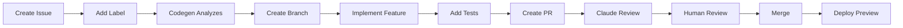
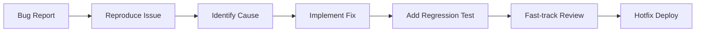

# 🤖 Automated Development System

## Overview

This repository uses an advanced automated development system combining **Codegen** and **Claude Code** to streamline development workflows, automate repetitive tasks, and maintain high code quality.

## 🚀 Quick Start

### Prerequisites

1. **Codegen Account**: Set up at [codegen.com](https://codegen.com)
2. **Claude Code OAuth Token**: Get from [Anthropic Console](https://console.anthropic.com)
3. **GitHub App Installation**: Install Codegen GitHub App on your repository
4. **Linear Integration**: Connect Linear workspace (optional)
5. **Slack Integration**: Connect Slack workspace for notifications (optional)

### Initial Setup

1. **Configure GitHub Secrets**:

   ```bash
   # Add Claude Code OAuth token to repository secrets
   gh secret set CLAUDE_CODE_OAUTH_TOKEN
   ```

2. **Enable Codegen Integration**:
   - Go to [Codegen Integrations](https://codegen.com/integrations)
   - Connect GitHub repository
   - Configure Linear and Slack if needed

3. **Verify Workflows**:

   ```bash
   # Check workflow status
   gh workflow list
   
   # View recent runs
   gh run list
   ```

## 🔄 Automated Workflows

### 1. Issue to PR Automation

When an issue is created with appropriate labels, Codegen automatically:

1. **Analyzes the issue** using AI to understand requirements
2. **Creates a feature branch** with proper naming convention
3. **Implements the solution** following project patterns
4. **Adds tests** for new functionality
5. **Creates a PR** with detailed description
6. **Requests review** from designated reviewers

**Trigger Labels**:

- `codegen:auto-implement` - Automatic implementation
- `enhancement` - New features
- `bug` - Bug fixes

**Example**:

```markdown
# Issue Title: Add dark mode support

## Description
Implement dark mode toggle in the settings page

## Labels
- enhancement
- codegen:auto-implement
```

### 2. Automated Code Review

Every PR automatically receives:

- **Claude Code Review**: AI-powered code review focusing on:
  - Code quality and best practices
  - Potential bugs or issues
  - Performance considerations
  - Security concerns
  - Test coverage

- **Codegen Analysis**: Additional checks for:
  - Pattern compliance
  - Documentation completeness
  - Dependency security

### 3. PR Assistant (@claude)

Interact with Claude directly in PRs and issues:

```markdown
@claude Can you explain this implementation?
@claude Please add error handling to this function
@claude Write tests for the new feature
```

### 4. Linear Integration

Automatic synchronization between GitHub and Linear:

- **Issue Creation**: Linear tasks → GitHub issues
- **Status Updates**: PR status → Linear task status
- **Bidirectional Sync**: Changes reflect in both systems

**Status Mapping**:

| GitHub | Linear |
|--------|--------|
| Open Issue | Backlog |
| PR Created | In Progress |
| PR Review | In Review |
| PR Merged | Done |

### 5. Slack Notifications

Real-time updates in Slack:

- **#github-activity**: PR created, merged, reviewed
- **#alerts**: Build failures, security issues

## 📋 Available Commands

### In Issues/PRs

| Command | Description | Example |
|---------|-------------|---------|
| `/implement` | Auto-implement feature | `/implement Add user authentication` |
| `/fix` | Fix reported bug | `/fix Resolve login timeout issue` |
| `/refactor` | Refactor code | `/refactor Optimize database queries` |
| `/test` | Add tests | `/test Add unit tests for auth module` |
| `/docs` | Update documentation | `/docs Document API endpoints` |

### Wake-up Triggers

Codegen automatically wakes up for:

- New issues with trigger labels
- PR comments mentioning `@codegen`
- Scheduled tasks (daily standup, weekly cleanup)
- Webhook events from integrated services

## 🛡️ Quality Gates

### Pre-commit Checks

- Linting (ESLint, Prettier)
- Type checking (TypeScript)
- Format validation

### Pre-merge Requirements

- All tests passing
- 80% code coverage minimum
- No security vulnerabilities
- At least one approved review
- Claude Code review completed

### Post-merge Actions

- Deploy to preview environment
- Run smoke tests
- Update Linear task status
- Notify Slack channel

## 📊 Monitoring & Metrics

### Key Metrics Tracked

- **PR Turnaround Time**: Time from creation to merge
- **Issue Resolution Time**: Time from report to fix
- **Code Coverage Trend**: Coverage percentage over time
- **Dependency Freshness**: Percentage of up-to-date dependencies
- **Security Score**: Based on vulnerability scans

### Weekly Reports

Automated weekly summaries include:

- Completed tasks and PRs
- Open issues and blockers
- Code quality metrics
- Performance statistics

## 🔧 Configuration

### Customizing Automation

Edit `.codegen.yml` to modify:

```yaml
automation:
  auto_pr:
    enabled: true
    triggers:
      - label: "your-custom-label"
```

### Adding Custom Workflows

Define new workflows in `.codegen.yml`:

```yaml
workflows:
  custom_workflow:
    steps:
      - analyze_requirements
      - implement_changes
      - create_pr
```

### Adjusting AI Behavior

Customize AI prompts in `.codegen.yml`:

```yaml
ai_agent:
  prompts:
    implementation: |
      Your custom implementation instructions
```

## 🚨 Troubleshooting

### Common Issues

1. **Bot Permission Error**:

   ```yaml
   # In workflow files, add:
   allowed_bots: "codegen-sh,dependabot"
   ```

2. **OAuth Token Issues**:

   ```bash
   # Verify token is set
   gh secret list
   
   # Update token
   gh secret set CLAUDE_CODE_OAUTH_TOKEN
   ```

3. **Workflow Not Triggering**:
   - Check label configuration
   - Verify GitHub App permissions
   - Review workflow conditions

### Debug Commands

```bash
# View workflow logs
gh run view <run-id> --log

# Check workflow status
gh workflow view <workflow-name>

# List recent failures
gh run list --workflow=<workflow-name> --status=failure
```

## 📚 Best Practices

### 1. Issue Creation

- Use clear, descriptive titles
- Add appropriate labels for automation
- Include acceptance criteria
- Reference related issues/PRs

### 2. PR Management

- Keep PRs focused and small
- Write descriptive PR descriptions
- Respond to automated reviews
- Use draft PRs for work in progress

### 3. Automation Usage

- Don't override automation without reason
- Review AI-generated code carefully
- Maintain human oversight
- Document automation decisions

## 🔐 Security Considerations

### Protected Actions

- Production deployments require manual approval
- Sensitive file changes trigger additional review
- Secret scanning blocks commits with credentials
- Dependency vulnerabilities block merges

### Access Control

- Codegen bot has read/write repository access
- Claude Code has read access + PR comments
- Linear sync uses separate API tokens
- Slack uses webhook authentication

## 📈 Workflow Examples

### Example 1: Feature Development



### Example 2: Bug Fix



## 🎯 Advanced Features

### 1. Multi-Repository Coordination

Codegen can coordinate changes across multiple repositories:

- Synchronized PRs
- Cross-repo dependencies
- Atomic merges

### 2. Intelligent Context

AI maintains context across:

- Related issues and PRs
- Previous implementations
- Project documentation
- Team preferences

### 3. Learning & Adaptation

System improves over time by:

- Learning from code review feedback
- Adapting to project patterns
- Optimizing for team velocity
- Reducing false positives

## 📞 Support & Resources

### Documentation

- [Codegen Docs](https://docs.codegen.com)
- [Claude Code Action](https://github.com/anthropics/claude-code-action)
- [Linear API Docs](https://linear.app/docs)

### Community

- [Codegen Discord](https://discord.gg/codegen)
- [GitHub Discussions](https://github.com/evgenygurin/awesome-claude-code/discussions)

### Contact

- **Issues**: Create GitHub issue with `question` label
- **Email**: <support@codegen.com>
- **Slack**: #codegen-support channel

## 🚀 Future Enhancements

### Planned Features

- [ ] Voice-activated commands
- [ ] Mobile app integration
- [ ] Advanced analytics dashboard
- [ ] Custom AI model training
- [ ] Multi-language support

### Roadmap

- **Q1 2025**: Enhanced Linear integration
- **Q2 2025**: Custom workflow builder
- **Q3 2025**: AI pair programming
- **Q4 2025**: Full CI/CD automation

---

## License

This automated development system configuration is part of the Awesome Claude Code project and follows the same license terms.

## Contributing

To improve the automation system:

1. Fork the repository
2. Create a feature branch
3. Update `.codegen.yml` or workflows
4. Test your changes
5. Submit a PR with detailed description

---

*Powered by [Codegen](https://codegen.com) and [Claude Code](https://claude.ai)*
