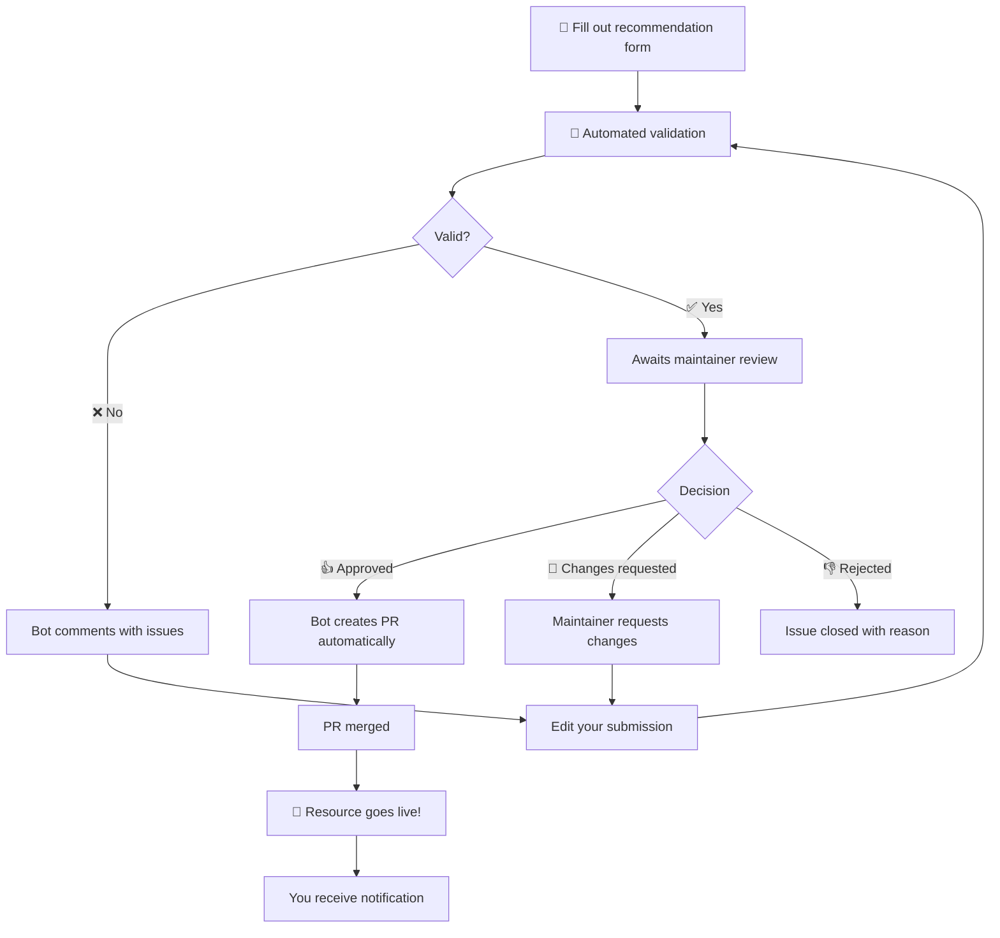

# Contributing to Awesome Claude Code

Please take a moment to read through this docoument if you plan to submit something for recommendation.

- I am very grateful to receive recommendations from the visitors to this list. But be aware that there is no formal submission/review process at the moment. My responsibility is to share links to awesome things. One way I find out about awesome things is via the repo's issues, and I'm very grateful to everyone who shares their amazing work. But it's not the only way, and creating an issue does not represent any sort of contract.
- Bear in mind that the point of an Awesome List is to be *selective* - I cannot recommend every single resource that is submitted.
- The goal of this list is to identify and highlight resources that provide value to the Claude Code community - not the other way around. Please do not create any repositories just so that you can submit them to this list. And don't plan a marketing strategy that has anything to do with being added to the list.
- I prioritize the following above all: ***security***. Usually, I have to run the software in order to know if it's any good. And I am not content to recommend something unless I have high confidence that it is not malicious or overly risky - and that any risks (permissions, etc.) are prominently declared.
- Understand that I am not going to download and execute a shell script or a binary unless I have high confidence that it is safe to do so. The longer the shell script is, the less likely that I'm going to execute it. Also bear in mind that I am probably not going to devote an entire week to ramping up on a specialized framework.

If getting a review from the maintainer is important to you, here are some things that might help:

- What I tend to prioritize: projects that are (i) easy to try out and show their value immediately; (ii) projects with great documentation (especially demos); (iii) projects that easy to spin up and tear down (and even better if they don't touch any core directories); (iv) projects that are unique or creative; (v) projects that are "interoperable" - meaning, resources that users can adapt to their own workflow, rather than ones that require total buy-in.
- Try to make it as easy and as fast as possible for the user to see the value in your software. If you make bold claims, you must be prepared to offer clear and convincing evidence. Tell me exactly what task I should give to Claude and what prompts I should use.

## How to Recommend a Resource

First, make sure you've read the above information. Second, make sure you've read, and agree with, the [Code of Conduct](./CODE_OF_CONDUCT.md) Then:

### **[Click here to submit a new resource](https://github.com/hesreallyhim/awesome-claude-code/issues/new?template=recommend-resource.yml)**

That's it! Just click the link above and fill out the form. You don't even need to use git. (And please don't open a PR for this.)

> [!Warning]
> It is **not** possible to submit a resource recommendation using the `gh` CLI.

Resource recommendations must be created by human beings.

### The Recommendation Process

The entire recommendation process is managed via automation - even the maintainer does not use PRs to add entries to the list. The bot is really good at it. Here's what happens when you submit a resource for recommendation:



### What the Bot Validates

When you submit a resource, the bot checks:

- All required fields are filled
- URLs are valid and accessible
- No duplicate resources exist
- License information (when available)
- Description length and quality

The bot's validation is not any sort of review. It's merely a formal check.

## Other Contributions

### Suggesting Improvements

For suggestions about the repository structure, new categories, or other enhancements:

1. **[Open a general issue](https://github.com/hesreallyhim/awesome-claude-code/issues/new)**
2. Describe your suggestion clearly
3. Explain the benefit to the community

Or, alternatively, start a thread in the [Discussions](https://github.com/hesreallyhim/awesome-claude-code/discussions) tab. All opinions are welcome in this repo so long as they are expressed in accordance with the Code of Conduct. It's very nice to interact with people who visit the list.

## Badges

If your submission is approved, you are invited to add a badge to your project's README:

[](https://github.com/hesreallyhim/awesome-claude-code)

```markdown
[](https://github.com/hesreallyhim/awesome-claude-code)
```

Or the flat version:

[](https://github.com/hesreallyhim/awesome-claude-code)

```markdown
[](https://github.com/hesreallyhim/awesome-claude-code)
```

## GitHub Repository Notifications

If your resource is on GitHub, our automated system will create a friendly notification issue on your repository informing you of the inclusion and providing badge options.

## Technical Details

For more information about how the repository works, including the automated systems, validation processes, the "multi-list design and technical architecture, see the documents in `docs/` - in particular `README_GENERATION`.

---

Thank you for taking the time to read this and to share your project (or any project).
